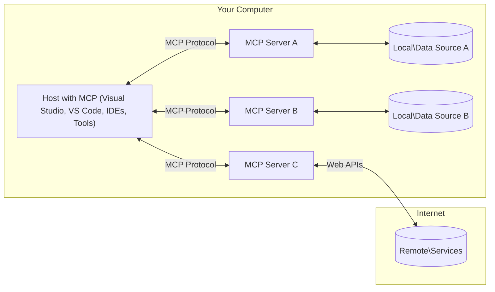

## MCP 架构

MCP 生态系统基于客户端-服务器模型。这种模块化结构使 AI 应用能够高效地与工具、数据库、API 和上下文资源交互。让我们将这一架构分解为核心组件。

MCP 的核心是一个客户端-服务器架构，其中主机应用程序可以连接到多个服务器：

```mermaid
flowchart LR
    subgraph "Your Computer"
        Host["Host with MCP (Visual Studio, VS Code, IDEs, Tools)"]
        S1["MCP Server A"]
        S2["MCP Server B"]
        S3["MCP Server C"]
        Host <-->|"MCP Protocol"| S1
        Host <-->|"MCP Protocol"| S2
        Host <-->|"MCP Protocol"| S3
        S1 <--> D1[("Local\Data Source A")]
        S2 <--> D2[("Local\Data Source B")]
    end
    subgraph "Internet"
        S3 <-->|"Web APIs"| D3[("Remote\Services")]
    end
```

