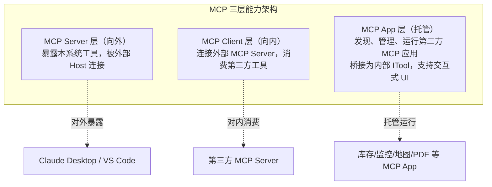

# NewLife.AI 竞品分析报告

> 版本：v2.0 | 日期：2026-09-04 | 基于联网搜索 GitHub 2026-09-04 数据

## 1. 概述

本报告对比 **NewLife.AI**（.NET 开源 AI 基础库 / NuGet 包）与市面主流 .NET AI 库与 Agent 框架竞品，覆盖模型接入、工具/MCP、记忆知识、多模态、框架兼容等维度。

NewLife.AI 的独特定位是 **net45 到 net10 全框架兼容 + 46 服务商统一接入 + 中文模型生态原生适配** 的 .NET AI 基础设施库。对比对象：

- **Microsoft.Extensions.AI（MEAI）**：微软官方 `IChatClient` 抽象层，NewLife.AI 对齐其规范，是兼容伙伴而非直接竞品
- **Semantic Kernel（SK）**：微软模型无关 AI SDK（.NET 主线）
- **Microsoft Agent Framework（MAF）**：微软企业级多 Agent 框架（.NET 主线）
- **AutoGen**：微软多 Agent 框架（已实质停更，仅供状态参考）
- **OpenClaw.NET**：.NET 个人 AI 运行时，MCP Apps 先行者（参考对象，见 §5）

> 本报告仅分析 **NewLife.AI 库层面**；上层 Web 对话应用（ChatAI/StarChat）的竞品分析见 [StarChat 竞品分析](../../Doc/StarChat竞品分析.md)。

---

## 2. 竞品概览

### 2.1 竞品一览（.NET AI 库 / Agent 框架）

| 项目 | 语言 | 许可证 | 最新版本 | GitHub Stars | 定位 |
|------|------|--------|---------|-------------|------|
| **NewLife.AI** | C# (.NET) | MIT | 1.6.2026.0902 | — | .NET AI 基础库，46 服务商统一接入 |
| **Microsoft.Extensions.AI** | C# (.NET) | MIT | dotnet/extensions v10.9.0 (2026-08-12) | 3.2k | 微软官方 `IChatClient` 抽象层 |
| **Semantic Kernel** | C# + Python | MIT | dotnet-1.80.1 (2026-09-03) | 28.5k | 模型无关 AI SDK（战略转向 MAF） |
| **Microsoft Agent Framework (MAF)** | Python + C# | MIT | dotnet-1.20.0 (2026-08-31) | 13.3k | 企业级多 Agent 框架 |
| **AutoGen** | Python + C# | MIT | v0.7.5 (2025-09-30，停更) | 60.8k | 多 Agent 实验框架（已迁 MAF） |
| **OpenClaw.NET** | C# (.NET) | 开源 | v0.1.4 (2026-08-06) | 492 | .NET 个人 AI 运行时，率先支持 MCP Apps |

> **注**：① Semantic Kernel 仍保持周更发版（dotnet-1.80.1），但微软战略重心已转向 MAF，定位为底层 SDK 组件；AutoGen 已实质停更（最后 Release 2025-09-30，仓库 2026-04 后无推送）。② MEAI 是微软官方抽象规范，NewLife.AI 的 `IChatClient` 对齐其接口，二者为兼容伙伴关系。③ OpenClaw.NET 数据来源：[clawdotnet/openclaw.net](https://github.com/clawdotnet/openclaw.net)（README 明示 First-class MCP App support）。

---

## 3. 功能对比矩阵（NewLife.AI vs MEAI / Semantic Kernel / MAF）

> 标记：✅ 完整支持 | ⚠️ 部分可用 | 🔧 规划中 | ❌ 不支持 | — 不适用

### 3.1 模型接入与协议

| 功能 | NewLife.AI | MEAI | Semantic Kernel | MAF |
|------|:---:|:---:|:---:|:---:|
| 统一 `IChatClient` 接口 | ✅ 对齐 MEAI | ✅ 定义方 | ✅ Kernel | ✅ |
| 服务商数量 | ✅ 46 家 | ⚠️ 依赖各 Provider | ✅ 多 Connector | ✅ 多 Provider |
| 独立协议实现（非 OpenAI 兼容） | ✅ 6 类 | ⚠️ | ⚠️ | ⚠️ |
| Anthropic Messages 原生（含多轮思考回传） | ✅ | ⚠️ 需扩展 | ✅ | ✅ |
| Google Gemini 原生 | ✅ | ⚠️ 需扩展 | ✅ | ✅ |
| 阿里 DashScope 原生（含 Omni 全模态） | ✅ | ❌ | ❌ | ❌ |
| AWS Bedrock SigV4 | ✅ | ⚠️ | ✅ | ✅ |
| Ollama 原生协议（v1.6 新增） | ✅ | ✅ | ✅ | ✅ |
| 本地模型（LM Studio/vLLM/OneAPI 等） | ✅ 多通道 | ⚠️ | ⚠️ | ⚠️ |
| 模型能力元数据标记 + 家族化推断 | ✅ | ❌ | ❌ | ❌ |
| 统一 Token 估算（TokenEstimator） | ✅ | ❌ | ⚠️ | ⚠️ |
| 连接池复用（HttpClientPool） | ✅ | ❌ | ⚠️ | ⚠️ |
| 低框架兼容（net45/netstandard2.0/2.1） | ✅ | ❌ net8+ | ❌ net8+ | ❌ net8+ |

### 3.2 工具、Agent 与 MCP

| 功能 | NewLife.AI | MEAI | Semantic Kernel | MAF |
|------|:---:|:---:|:---:|:---:|
| 函数调用（自动 JSON Schema） | ✅ `[ToolDescription]` | ✅ | ✅ Plugin | ✅ |
| 工具多轮循环 | ✅ ToolChatClient | ✅ | ✅ | ✅ |
| 工具三档权限（Allow/Ask/Deny） | ✅ | ❌ | ❌ | ⚠️ HITL |
| 工具链安全（SSRF 防护/状态隔离） | ✅ | ❌ | ⚠️ | ⚠️ |
| MCP 服务端（AspNet/Stdio/Http 传输） | ✅ 核心库 | ⚠️ 需扩展 | ⚠️ | ⚠️ |
| MCP 客户端（核心库层面） | ❌ 上层应用实现 | ⚠️ 需扩展 | ✅ | ✅ |
| MCP 协议合规（对标官方 C# SDK） | ✅ v1.6 重构 | ✅ 官方生态 | ✅ | ✅ |
| MCP Apps（交互式 UI 托管） | 🔧 规划中 | ❌ | ❌ | ❌ |
| Planner 规划器 | ✅ | ❌ | ✅ | ✅ 图编排 |
| 多 Agent（GroupChat/Parallel） | ✅ | ❌ | ⚠️ | ✅ |
| Agent-as-Tool | ✅ | ❌ | ✅ | ✅ |
| 反思/评审代理（Critic/Reflection） | ✅ | ❌ | ⚠️ | ⚠️ |
| 过滤器/中间件管道 | ✅ IChatFilter | ✅ | ✅ | ✅ Middleware |

### 3.3 记忆、知识与多模态

| 功能 | NewLife.AI | MEAI | Semantic Kernel | MAF |
|------|:---:|:---:|:---:|:---:|
| 用户记忆自动提取（10 类） | ✅ | ❌ | ⚠️ Memory | ⚠️ Memory |
| 统一向量存储接口（语义记忆） | ✅ | ⚠️ 抽象 | ⚠️ | ⚠️ |
| 重排序接口 | ✅ | ❌ | ❌ | ⚠️ |
| 图片生成/编辑 | ✅ | ⚠️ | ⚠️ | ⚠️ |
| 视频生成（万相） | ✅ | ❌ | ❌ | ❌ |
| 语音识别/合成（TTS） | ✅ CosyVoice | ❌ | ⚠️ | ❌ |
| CodingAgent（代码智能体） | ✅ | ❌ | ⚠️ | ✅ |
| 搜索通道（Bing/搜狗/DuckDuckGo） | ✅ v1.6 | ❌ | ⚠️ | ❌ |

---

## 4. 非功能维度对比

| 维度 | NewLife.AI | MEAI | Semantic Kernel | MAF |
|------|:---:|:---:|:---:|:---:|
| 框架兼容 | net45/netstandard2.0/2.1 | net8.0+ | net8.0+ | net8.0+ |
| 中文模型生态原生支持 | ✅ DashScope/DeepSeek | ❌ | ❌ | ❌ |
| 外部依赖 | 极少（NewLife.Core） | 少 | 中（Azure 系） | 中（Azure 系） |
| 维护状态 | ✅ 活跃（v1.6，2026-09-02） | ✅ 活跃 | ⚠️ 战略转向 MAF（仍周更） | ✅ 活跃（周更） |
| 社区规模 | 小 | 大（官方） | 大（官方+社区） | 中（官方） |

---

## 5. MCP 专项分析（关键战略方向）

### 5.1 行业动态：MCP 从「工具调用」进化到「应用托管」

2026 年 1 月，Anthropic 发布 **MCP Apps**（扩展标识 `io.modelcontextprotocol/ui`），将「交互式 UI」纳入 MCP 能力版图。MCP 工具不再只返回文本，而是可以返回嵌在对话窗口里的 **iframe 交互界面**——按钮能点、图表能拖、表单能填，并通过 `ui/update-model-context` 通道把用户的每一次操作实时反馈给大模型，形成 **用户操作 → 更新上下文 → LLM 重新决策 → 刷新界面** 的 Human-in-the-Loop 闭环。该规范已收录于 [modelcontextprotocol/modelcontextprotocol](https://github.com/modelcontextprotocol/modelcontextprotocol) 官方仓库（博客 2025-11-21 与 2026-01-26 两篇 + `working-groups/apps` 工作组）。

MCP 生态正形成 **三层架构**：

.NET 生态中，**OpenClaw.NET**（clawdotnet/openclaw.net）已原生支持 MCP Apps：README 明示「First-class MCP App support」，提供 `docs/MCPAPP.md` 描述应用清单发现、生命周期管理、工具桥接与交互式 UI 资源，并通过 `/apps/health`、`/apps/mcp/{appId}`、`/apps/chat` 网关路由托管 MCP App UI。官方 `modelcontextprotocol/csharp-sdk` 也已与微软协作维护。

### 5.2 NewLife.AI 现状（v1.6 更新）

| MCP 能力 | 现状 | 说明 |
|---------|------|------|
| MCP 协议核心 | ✅ v1.6 已自包含重构 | 移除 Remoting 依赖，服务端/客户端/协议/传输全链路对标官方 C# SDK |
| MCP 服务端 | ✅ 已实现 | `NewLife.AI.Extensions/AspNetMcpServer.cs`、核心库 `ModelContextProtocol/McpServer.cs`（含 Stdio/Http 传输） |
| MCP 客户端 | ⚠️ 实现于上层应用层 | `McpClientService` 含 DB 依赖与配置管理，未下沉到核心库/Extensions |
| MCP App 托管层 | ❌ 未实现 | — |

**v1.6 关键进展**：MCP 协议核心已自包含化并全链路对标官方 SDK（EnableMcp 配置、非 Web 场景兼容、传输与测试全面增强），但 MCP **客户端仍未下沉**到 NewLife.AI 核心库——不引用上层 Web 应用的下游项目，仍无法直接使用 MCP 客户端连接外部工具服务器。

### 5.3 战略方向：MCP 客户端下沉 NewLife.AI，补齐三层能力

**结论**：MCP 已是 .NET AI 库的基础设施级能力（MAF、Semantic Kernel、官方 C# SDK 全部支持），NewLife.AI 作为开源核心库应在**自身层面**完整具备 MCP 双向能力，而非依赖上层应用。

| 阶段 | 行动 | 目标 |
|:---:|------|------|
| **P0** | MCP 客户端核心能力（连接/握手/工具发现，无 DB 依赖）下沉至 `NewLife.AI` 或 `NewLife.AI.Extensions` | 核心库自带 MCP 双向（Client + Server），下游项目零依赖即可消费外部 MCP Server |
| **P0** | 统一 MCP 传输层：stdio 子进程 / HTTP SSE / 进程内 | 覆盖本地工具到远程服务全场景（v1.6 已重构协议核心，此步聚焦客户端壳层） |
| **P1** | MCP 客户端桥接为 `IToolProvider`，与 ToolChatClient 无缝集成 | Agent 调用外部 MCP 工具与原生工具体验一致（上层已有实现，需下移复用） |
| **P2** | 引入 MCP App 托管层（参考三层架构） | 发现/管理/运行第三方 MCP 应用，支持 `text/html;profile=mcp-app` 交互式 UI |
| **P3** | 上层应用渲染 MCP Apps 的 iframe 沙箱与 `ui/update-model-context` 闭环 | 落地交互式 HITL（属应用层职责） |

---

## 6. 差距分析与结论

### 6.1 NewLife.AI 优势

- **唯一兼顾 net45/netstandard2.0/2.1 低框架的现代 AI 库**：竞品全部要求 net8.0+，NewLife.AI 可嵌入大量存量 .NET 项目
- **中文模型生态原生适配**：DashScope（含 Omni 全模态）、DeepSeek 专属参数等竞品均无
- **模型能力元数据 + 家族化推断**：46 服务商的 Thinking/Vision/Audio/Image/Video/Speech 标记与家族规则（如 qwen3.7 1M 上下文识别），竞品均无此粒度
- **服务商覆盖最广（46 家）且多协议原生**：Anthropic/Gemini/DashScope/Bedrock/Ollama 6 类独立协议 + OpenAI 兼容通道
- **开箱即用的记忆进化与多模态**：用户记忆提取、视频生成、TTS、统一向量存储、搜索通道等竞品需额外集成
- **工具链安全**：SSRF 防护与状态隔离、Token 预算守卫，企业级安全特性领先

### 6.2 NewLife.AI 差距

| 差距 | 严重程度 | 建议 |
|------|:---:|------|
| MCP 客户端未在核心库层面提供 | 高 | 见 §5.3，P0 下沉至核心库/Extensions（v1.6 已重构协议核心，剩余客户端壳层下沉） |
| MCP App 托管层缺失 | 中 | 跟进 MCP Apps 三层架构（OpenClaw.NET 已实现，可参考） |
| 社区规模与官方背书 | 高 | 持续开源运营，强化文档与示例 |
| 图编排式多 Agent 工作流 | 中 | MAF 已提供图工作流，可借鉴其声明式编排思路 |
| 与 MEAI 生态协同 | 中 | 已对齐 `IChatClient` 规范，可进一步输出 MEAI 适配层/中间件提升互操作性 |

### 6.3 核心结论

1. **MCP 是当前 .NET AI 库的基础设施级能力**：NewLife.AI 需在核心库层面（非上层应用）完整实现 MCP 客户端与服务端，并前瞻布局 MCP App 托管层——这是本次竞品分析最重要的行动项（详见 §5.3）
2. **NewLife.AI 在低框架兼容、中文模型生态与服务商覆盖上独占优势**，是存量 .NET 项目接入 AI 的最低成本选择；v1.6 的 MCP 协议自包含重构与 Ollama 原生支持进一步巩固了这一地位
3. **与 MEAI 是兼容伙伴而非竞品**：持续对齐官方抽象规范，可同时受益于微软生态演进与自身差异化能力

---

## 7. 数据来源与更新说明

- 数据采集日期：2026-09-04（GitHub API）
- v2.0 变更：① 范围收窄为 **NewLife.AI 库层面**，ChatAI 对话应用竞品分析移入 [StarChat 竞品分析](../../Doc/StarChat竞品分析.md)；② 刷新全部竞品版本与 Stars；③ 新增 OpenClaw.NET 仓库核实数据；④ 修正 Semantic Kernel 维护状态表述（仍周更发版但战略转向 MAF）、确认 AutoGen 停更；⑤ 同步 NewLife.AI v1.6 进展（MCP 协议自包含重构、Ollama 原生、模型元数据家族化、Token 估算统一等）
- MCP Apps 规范：https://github.com/modelcontextprotocol/modelcontextprotocol（官方仓库）
- OpenClaw.NET：https://github.com/clawdotnet/openclaw.net
- Microsoft Agent Framework：https://github.com/microsoft/agent-framework
