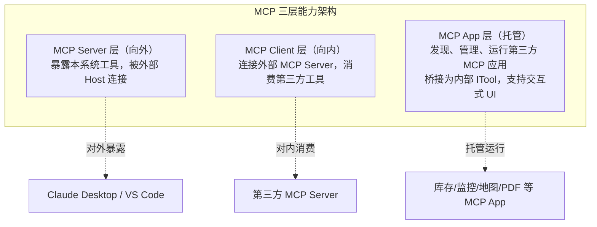

# NewLife.AI 与 ChatAI 竞品分析报告

> 版本：v1.0 | 日期：2026-06-30 | 基于联网搜索 GitHub 2026-06-30 数据

## 1. 概述

本报告以 NewLife.AI 生态愿景为基准，对比市面主流竞品。NewLife.AI 生态包含两个层次的产品，分属两个不同竞争赛道，因此本报告分为两大部分：

| 产品 | 定位 | 竞争赛道 |
|------|------|---------|
| **NewLife.AI** | 面向 .NET 的开源 AI 基础库（NuGet 包） | .NET AI 库 / Agent 框架 |
| **NewLife.ChatAI** | 构建于 NewLife.AI 之上的开源 Web 对话应用 | 开源自托管对话平台 |

报告从功能覆盖、协议适配、MCP 支持、部署模式、许可与生态等维度综合评估，并基于 [MCP Apps 行业动态](#5-mcp-专项分析关键战略方向) 提出 NewLife.AI 全面支持 MCP 协议的战略方向。

---

## 2. 竞品概览

### 2.1 NewLife.AI 库竞品（.NET AI 库 / Agent 框架）

| 项目 | 语言 | 许可证 | 最新版本 | GitHub Stars | 定位 |
|------|------|--------|---------|-------------|------|
| **NewLife.AI** | C# (.NET) | MIT | 1.0.2026.x | — | .NET AI 基础库，46 服务商统一接入 |
| **Microsoft.Extensions.AI** | C# (.NET) | MIT | 随 dotnet/extensions | — | 微软官方 `IChatClient` 抽象层 |
| **Microsoft Agent Framework (MAF)** | Python + C# | MIT | dotnet-1.11.1 (2026-06-26) | 11.8k | 企业级多 Agent 框架 |
| **Semantic Kernel** | C# + Python | MIT | python-1.43.1 (维护模式) | 28.2k | 模型无关 AI SDK（已转 MAF） |
| **OpenClaw.NET** | C# (.NET) | 开源 | main 持续迭代 | 社区项目 | .NET 生态率先支持 MCP Apps |
| **AutoGen** | Python + C# | MIT | v0.7.5 (维护模式) | 59.4k | 多 Agent 实验框架（已转 MAF） |

> **注**：Semantic Kernel 与 AutoGen 已进入维护模式，微软主力迁移至 MAF。Microsoft.Extensions.AI（MEAI）是 .NET 官方 `IChatClient` 抽象，NewLife.AI 对齐其规范，是兼容伙伴而非直接竞品。OpenClaw.NET 数据来源为 [dotNET 跨平台公众号文章](https://mp.weixin.qq.com/s/juqO1qNN9lFf2lqwm3YcxA)（2026-06-30）。

### 2.2 ChatAI Web 对话竞品（开源自托管平台）

| 项目 | 语言 | 许可证 | 最新版本 | GitHub Stars | 定位 |
|------|------|--------|---------|-------------|------|
| **NewLife.ChatAI** | C# + TypeScript | MIT | 1.0.2026.x | — | .NET 开源 Web 对话应用 |
| **Open WebUI** | Python + Svelte | Open WebUI License（含品牌保留条款） | v0.10.1 (2026-06-30) | 143k | 功能丰富的自托管 AI 平台 |
| **LobeChat / LobeHub** | TypeScript | LobeHub Community License | v2.2.9 (2026-06) | 79.2k | Agent 运营工作空间 |
| **LibreChat** | TypeScript | MIT | v0.8.7 (2026-06-25) | 40k | 增强版 ChatGPT 克隆 |

---

## 3. NewLife.AI 库竞品功能矩阵

> 标记：✅ 完整支持 | ⚠️ 部分可用 | 🔧 规划中 | ❌ 不支持 | — 不适用

### 3.1 模型接入与协议

| 功能 | NewLife.AI | MEAI | MAF | Semantic Kernel |
|------|:---:|:---:|:---:|:---:|
| 统一 `IChatClient` 接口 | ✅ 对齐 MEAI | ✅ 定义方 | ✅ | ✅ Kernel |
| 服务商数量 | ✅ 46 家 | ⚠️ 依赖各 Provider | ✅ 多 Provider | ✅ 多 Connector |
| 独立协议实现（非 OpenAI 兼容） | ✅ 9 个 | ⚠️ | ⚠️ | ⚠️ |
| Anthropic Messages 原生 | ✅ | ⚠️ 需扩展 | ✅ | ✅ |
| Google Gemini 原生 | ✅ | ⚠️ 需扩展 | ✅ | ✅ |
| 阿里 DashScope 原生（含 Omni） | ✅ | ❌ | ❌ | ❌ |
| AWS Bedrock SigV4 | ✅ | ⚠️ | ✅ | ✅ |
| 本地模型（Ollama） | ✅ | ✅ | ✅ | ✅ |
| 模型能力元数据标记 | ✅ | ❌ | ❌ | ❌ |
| 低框架兼容（net45/netstandard2.1） | ✅ | ❌ net8+ | ❌ net8+ | ❌ net8+ |

### 3.2 工具、Agent 与 MCP

| 功能 | NewLife.AI | MEAI | MAF | Semantic Kernel |
|------|:---:|:---:|:---:|:---:|
| 函数调用（自动 JSON Schema） | ✅ `[ToolDescription]` | ✅ | ✅ | ✅ Plugin |
| 工具多轮循环 | ✅ ToolChatClient | ✅ | ✅ | ✅ |
| 工具三档权限（Allow/Ask/Deny） | ✅ | ❌ | ⚠️ HITL | ❌ |
| MCP 客户端 | ✅ | ⚠️ 需扩展 | ✅ | ✅ |
| MCP 服务端 | ✅ AspNetMcpServer | ❌ | ⚠️ | ⚠️ |
| MCP Apps（交互式 UI 托管） | 🔧 规划中 | ❌ | ❌ | ❌ |
| Planner / 多 Agent | ✅ | ❌ | ✅ 图编排 | ✅ |
| Agent-as-Tool | ✅ | ❌ | ✅ | ✅ |
| 反思/评审代理 | ✅ | ❌ | ⚠️ | ⚠️ |
| 过滤器/中间件管道 | ✅ IChatFilter | ✅ | ✅ Middleware | ✅ |

### 3.3 记忆、知识与多模态

| 功能 | NewLife.AI | MEAI | MAF | Semantic Kernel |
|------|:---:|:---:|:---:|:---:|
| 用户记忆自动提取（10 类） | ✅ | ❌ | ⚠️ Memory | ⚠️ Memory |
| 嵌入/向量存储 | ✅ HashTextEmbedder | ⚠️ 抽象 | ⚠️ | ✅ Connector |
| 重排序接口 | ✅ | ❌ | ❌ | ⚠️ |
| 图片生成/编辑 | ✅ | ⚠️ | ⚠️ | ⚠️ |
| 视频生成 | ✅ 万相 | ❌ | ❌ | ❌ |
| 语音识别/合成（TTS） | ✅ CosyVoice | ❌ | ❌ | ⚠️ |
| 统一 AI 网关（多协议兼容） | ✅ | ❌ | ❌ | ❌ |

---

## 4. ChatAI Web 对话竞品功能矩阵

### 4.1 对话体验

| 功能 | ChatAI | Open WebUI | LobeChat | LibreChat |
|------|:---:|:---:|:---:|:---:|
| 完整 Web 对话 UI | ✅ React 19 | ✅ Svelte | ✅ React | ✅ React |
| SSE 流式输出 | ✅ | ✅ | ✅ | ✅ |
| 可恢复流/断线续传 | ✅ | ✅ | ⚠️ | ✅ Redis |
| 推理过程可视化 | ✅ 计时 | ✅ | ✅ | ✅ |
| Artifact 实时预览（HTML/SVG/Mermaid） | ✅ | ⚠️ | ⚠️ | ✅ Code Artifacts |
| 对话分叉/续聊 | ✅ | ⚠️ | ⚠️ | ✅ Fork |
| 对话预设 / Presets | ✅ | ✅ | ✅ | ✅ |
| 对话导入/导出 | ✅ | ✅ | ✅ | ✅ |
| 全文搜索 | ✅ | ✅ | ✅ | ✅ |
| 多模态（图片/文档） | ✅ | ✅ | ✅ | ✅ |
| 多语言 UI | ✅ zh-CN/zh-TW/en | ✅ i18n | ✅ i18n | ✅ 30+ 语言 |

### 4.2 能力扩展与知识

| 功能 | ChatAI | Open WebUI | LobeChat | LibreChat |
|------|:---:|:---:|:---:|:---:|
| 技能系统（Markdown 复用） | ✅ `@` 递归引用 | ✅ Skills | ✅ | ✅ SKILL.md |
| 工具/插件 | ✅ 内置工具 | ✅ Tools/Pipe | ✅ 10000+ 插件 | ✅ Actions |
| MCP 支持 | ✅ 双向 | ✅ MCP/MCPO | ✅ MCP 插件 | ✅ MCP |
| 知识库 / RAG | ✅ TOC+向量 | ✅ 9 向量库 | ✅ | ✅ RAG API |
| 联网搜索 | ✅ | ✅ 数十 Provider | ✅ | ✅ |
| 用户记忆进化 | ✅ 10 类结构化 | ✅ Persistent | ✅ 白盒记忆 | ⚠️ |
| 多智能体协作 | ✅ GroupChat | ⚠️ | ✅ Agent Group | ✅ Subagents |
| 代码解释器 | ⚠️ | ✅ Terminal | ⚠️ | ✅ 沙箱多语言 |

### 4.3 运营与企业能力

| 功能 | ChatAI | Open WebUI | LobeChat | LibreChat |
|------|:---:|:---:|:---:|:---:|
| 多用户认证 | ✅ AppKey | ✅ LDAP/OAuth/SCIM | ✅ | ✅ OAuth2/LDAP |
| 细粒度 RBAC | ⚠️ | ✅ 群组权限 | ⚠️ | ✅ 角色权限 |
| 用量统计与计费 | ✅ | ✅ 仪表盘 | ⚠️ | ✅ Token 计量 |
| AI 网关（多协议兼容） | ✅ | ⚠️ | ❌ | ⚠️ |
| 管理后台 | ✅ 魔方 | ✅ Admin | ⚠️ | ✅ Admin Panel |
| 桌面客户端 | ⚠️ StarWing | ✅ Native | ✅ Desktop | ❌ |
| TTS 语音合成 | ✅ | ✅ 多引擎 | ✅ | ✅ |

---

## 5. MCP 专项分析（关键战略方向）

### 5.1 行业动态：MCP 从「工具调用」进化到「应用托管」

2026 年 1 月，Anthropic 发布 **MCP Apps**（扩展标识 `io.modelcontextprotocol/ui`），将「交互式 UI」纳入 MCP 能力版图。其核心变化是：MCP 工具不再只返回文本，而是可以返回嵌在对话窗口里的 **iframe 交互界面**——按钮能点、图表能拖、表单能填，并通过 `ui/update-model-context` 通道把用户的每一次操作实时反馈给大模型，形成 **用户操作 → 更新上下文 → LLM 重新决策 → 刷新界面** 的 Human-in-the-Loop 闭环。

这标志着 MCP 生态正在形成 **三层架构**：

.NET 生态中，**OpenClaw.NET** 已率先在 PR #168 中原生支持 MCP Apps（兼容 `text/html;profile=mcp-app` 规范），通过 `McpAppManifest`（应用清单）、`McpAppRegistry`（集中注册表）、`McpAppNativeTool`（桥接 ITool）等组件实现了完整的应用生命周期管理（Discovered → Validated → Loaded → Running → Stopped/Failed 六阶段状态机），并采用「默认禁用、零开销」的设计哲学。

### 5.2 NewLife.AI 现状

| MCP 能力 | 现状 | 代码位置 |
|---------|------|---------|
| MCP 服务端 | ✅ 已实现 | `NewLife.AI.Extensions/AspNetMcpServer.cs`、`NewLife.AI/ModelContextProtocol/McpServer.cs` |
| MCP 客户端 | ⚠️ 实现于上层应用 | `NewLife.ChatAI/Tools/McpClientService.cs` |
| MCP App 托管层 | ❌ 未实现 | — |

当前 MCP 服务端位于核心库的 `NewLife.AI.Extensions`，而 MCP 客户端却下沉在 `NewLife.ChatAI` 应用层。这导致**核心库 NewLife.AI 本身并未完整具备 MCP 双向能力**——任何不引用 ChatAI 的下游项目，无法直接使用 MCP 客户端连接外部工具服务器。

### 5.3 战略方向：NewLife.AI 全面支持 MCP，客户端与服务端统一落于 NewLife.AI.Extensions

**结论**：MCP 已是 .NET AI 库的基础设施级能力（MAF、Semantic Kernel、ChatAI 竞品 Open WebUI/LobeChat/LibreChat 全部支持），NewLife.AI 作为开源核心库必须**在自身层面**全面支持 MCP，而非依赖上层应用。

| 阶段 | 行动 | 目标 |
|:---:|------|------|
| **P0** | 将 MCP 客户端能力直接实现于 `NewLife.AI.Extensions` | 核心库自带 MCP 双向（Client + Server），下游项目零依赖 ChatAI 即可消费外部 MCP Server |
| **P0** | 统一 MCP 传输层：stdio 子进程 / HTTP SSE / 进程内 | 覆盖本地工具到远程服务全场景 |
| **P1** | MCP 客户端桥接为 `IToolProvider`，与 ToolChatClient 无缝集成 | Agent 调用外部 MCP 工具与原生工具体验一致 |
| **P2** | 引入 MCP App 托管层（参考三层架构） | 发现/管理/运行第三方 MCP 应用，支持 `text/html;profile=mcp-app` 交互式 UI |
| **P3** | 前端渲染 MCP Apps 的 iframe 沙箱与 `ui/update-model-context` 闭环 | 在 ChatAI/StarChat 中落地交互式 HITL |

> ChatAI 现有的 `McpClientService` 在能力下沉到 `NewLife.AI.Extensions` 后，应改为薄封装或直接复用核心库实现，避免重复维护两套 MCP 客户端。

---

## 6. 非功能维度对比

### 6.1 NewLife.AI 库维度

| 维度 | NewLife.AI | MEAI | MAF | Semantic Kernel |
|------|:---:|:---:|:---:|:---:|
| 框架兼容 | net45 / netstandard2.1 / net8 / net10 | net8.0+ | net8.0+ | net10.0+ |
| 中文模型生态原生支持 | ✅ DashScope/DeepSeek | ❌ | ❌ | ❌ |
| 外部依赖 | 极少（NewLife.Core） | 少 | 中（Azure 系） | 中（Azure 系） |
| 维护状态 | ✅ 活跃 | ✅ 活跃 | ✅ 活跃 | ⚠️ 维护模式 |
| 社区规模 | 小 | 大（官方） | 中（171 贡献者） | 大（438 贡献者） |

### 6.2 ChatAI Web 对话维度

| 维度 | ChatAI | Open WebUI | LobeChat | LibreChat |
|------|:---:|:---:|:---:|:---:|
| 技术栈 | C#/.NET + React | Python + Svelte | TypeScript | TypeScript |
| .NET 原生部署 | ✅ | ❌ | ❌ | ❌ |
| 许可证商用友好度 | ✅ MIT | ⚠️ 品牌保留条款 | ⚠️ 社区许可 | ✅ MIT |
| 部署方式 | .NET 单进程 | Docker/K8s/pip | Docker/Vercel | Docker/Helm |
| 社区规模 | 小 | 极大（824 贡献者） | 大（354 贡献者） | 大（412 贡献者） |
| 水平扩展 | ⚠️ | ✅ Redis | ⚠️ | ✅ Redis |

---

## 7. 差距分析与结论

### 7.1 NewLife.AI 优势与差距

**优势**：

- **唯一兼顾 net45/netstandard2.1 低框架的现代 AI 库**：竞品全部要求 net8.0+，NewLife.AI 可嵌入大量存量 .NET 项目
- **中文模型生态原生适配**：DashScope（含 Omni 全模态）、DeepSeek 专属参数等竞品均无
- **模型能力元数据体系**：46 服务商的 Thinking/Vision/Audio/Image/Video/Speech 标记
- **开箱即用的记忆进化与多模态**：用户记忆自动提取、视频生成、TTS 等竞品需额外集成

**差距**：

| 差距 | 严重程度 | 建议 |
|------|:---:|------|
| MCP 客户端未在核心库层面提供 | 高 | 见第 5 节，P0 下沉到 NewLife.AI.Extensions |
| MCP App 托管层缺失 | 中 | 跟进 MCP Apps 三层架构 |
| 社区规模与官方背书 | 高 | 持续开源运营，强化文档与示例 |
| 图编排式多 Agent 工作流 | 中 | MAF 已提供图工作流，可借鉴 |

### 7.2 ChatAI 优势与差距

**优势**：

- **.NET 全栈唯一**：竞品 Open WebUI（Python）、LobeChat/LibreChat（TS）均非 .NET，ChatAI 对 .NET 团队零技术栈切换成本
- **AI 网关 + 记忆进化**：多协议兼容网关与 10 类结构化记忆，竞品少有同时具备
- **许可证更友好**：MIT 无品牌保留条款，优于 Open WebUI 和 LobeChat

**差距**：

| 差距 | 严重程度 | 竞品参考 | 建议 |
|------|:---:|------|------|
| 社区规模 | 高 | Open WebUI 143k Stars | 降低上手门槛，丰富文档 |
| 细粒度 RBAC | 中 | Open WebUI 群组权限、LibreChat 角色 | 补充群组/角色权限 |
| 代码解释器/沙箱 | 中 | Open WebUI Terminal、LibreChat 多语言沙箱 | 评估安全沙箱执行 |
| 多语言 UI | 低 | LibreChat 30+ 语言 | 已支持 zh-CN/zh-TW/en，更多按需扩展 |
| 容器化部署 | ✅ ChatAI / StarChat | 竞品普遍 Docker + Redis | 两工程均提供 `Dockerfile` + `docker-compose.yml`，一行部署 |

### 7.3 核心结论

1. **MCP 是当前 .NET AI 库的基础设施级能力**，NewLife.AI 必须在核心库层面（NewLife.AI.Extensions）完整实现 MCP 客户端与服务端，并前瞻布局 MCP App 托管层——这是本次竞品分析最重要的行动项（详见第 5 节）。
2. **NewLife.AI 在低框架兼容与中文模型生态上独占优势**，是存量 .NET 项目接入 AI 的最低成本选择。
3. **ChatAI 是 .NET 生态唯一的完整开源对话平台**，最大短板是社区规模，应以开源运营和文档建设为核心追赶策略，避免盲目对齐竞品的全部企业功能。

---

## 8. 数据来源与更新说明

- 数据采集日期：2026-06-30
- MCP Apps 行业动态：[当 AI 不再只是"说话"：OpenClaw.NET 率先原生支持 MCP Apps](https://mp.weixin.qq.com/s/juqO1qNN9lFf2lqwm3YcxA)（dotNET 跨平台，2026-06-30）
- Microsoft Agent Framework：https://github.com/microsoft/agent-framework
- Semantic Kernel：https://github.com/microsoft/semantic-kernel
- Open WebUI：https://github.com/open-webui/open-webui
- LobeChat / LobeHub：https://github.com/lobehub/lobehub
- LibreChat：https://github.com/danny-avila/LibreChat

> **增量更新触发条件**：MCP 协议大版本变更、任一竞品发布大版本、或 MCP Apps 生态出现新的 .NET 实现时，更新对应矩阵标记与版本号。建议每季度刷新一次 Stars 与版本数据。
