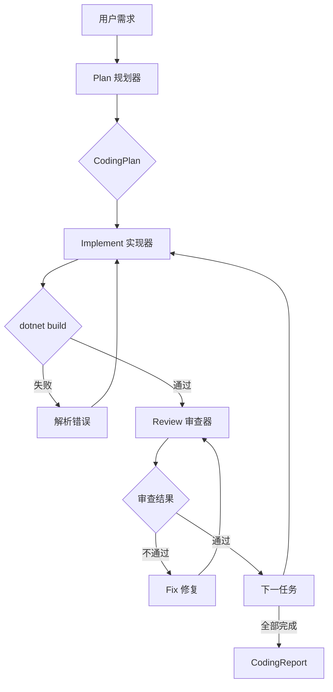

# 编程智能体（CodingAgent）

> 版本：v1.0 | 日期：2026-06-16
> 关联文档：[架构设计](架构设计.md)、[功能模块清单](功能模块清单.md)

编程智能体是基于 NewLife.AI 的 ACP（自主编码管道）实现。它将软件开发工作流编码为 Plan → Implement → Review 三阶段管道，自动加载用户 Copilot 技能和编码规范。

---

## 1. 概述

### 1.1 核心能力

| 阶段 | 职责 | 使用工具 |
|------|------|---------|
| Plan（规划） | 分析需求，探索项目结构，拆解为可执行任务 | read_file, list_dir, glob_search, grep_search |
| Implement（实现） | 逐任务编码，编译验证，失败自动修复 | 全部 8 个工具 |
| Review（审查） | 按检查清单逐条审查，不通过则修复后重审 | read_file, grep_search |

### 1.2 与 Copilot 的关系

CodingAgent 启动时自动扫描工作区和用户全局目录中的 Copilot 配置：
- `.github/instructions/*.md` → 编码规范注入
- `~/.copilot/skills/*/SKILL.md` → 按任务关键词匹配加载
- `~/.code/user/prompts/*.agent.md` → 审查清单生成

**不含 StarChat 依赖**，纯 SDK 实现，可独立部署于控制台、CI/CD 或任何 .NET 应用中。

---

## 2. 架构



## 3. 工具列表

| 工具 | 说明 | 安全级别 |
|------|------|---------|
| `read_file` | 读取文件内容，支持行范围 | ReadOnly |
| `write_file` | 创建或覆盖文件 | Destructive（需审批） |
| `list_dir` | 树形目录结构，maxDepth 默认 2 | ReadOnly |
| `glob_search` | 文件名 glob 匹配（支持 `**`） | ReadOnly |
| `grep_search` | 正则搜索代码，`文件:行号: 内容` | ReadOnly |
| `run_command` | 执行 shell 命令（如 dotnet build） | Destructive（需审批） |
| `get_errors` | 封装 `dotnet build`，解析 MSBuild 错误 | ReadOnly |
| `ask_user` | 控制台交互：暂停 Agent 向用户提问 | ReadOnly |

### 3.1 工作区沙箱

设置 `CodingTools.WorkspacePath` 后，所有文件操作限制在工作区范围内：
- **工作区内**：直接执行
- **工作区外**：调用 `IToolApprovalProvider` 请求审批；未设置审批时直接拒绝

路径安全由代码层强制执行（遵循"代码强制原则"）。

---

## 4. 使用方式

### 4.1 控制台应用

```csharp
using NewLife.AI.Clients.OpenAI;
using NewLife.AI.Coding;

var baseClient = new NewLifeAIChatClient(apiKey, "qwen3.5-coder", "http://localhost:5080");
var tools = new CodingTools(@"D:\MyProject");
var agent = new CodingAgent(baseClient, tools, @"D:\MyProject");

agent.OnPhaseChanged += (phase, msg) => Console.WriteLine($"[{phase}] {msg}");
agent.OnLog += (level, msg) => Console.WriteLine($"[{level}] {msg}");

var report = await agent.RunAsync("给 ChatController 新增 GetById 接口");
Console.WriteLine($"全部通过: {report.AllPassed}");
```

### 4.2 自定义 System Prompt

```csharp
var agent = new CodingAgent(client, tools, workspace)
{
    // 自定义各阶段 Prompt（不设置则使用内置默认值）
    PlanSystemPrompt = "你是一名 .NET 架构师……",
    ImplementSystemPrompt = "你是一名 C# 高级开发……",
    ReviewSystemPrompt = "你是一名代码审查员……",
    
    // 调整重试策略
    MaxFixRetries = 5,
    MaxReviewRetries = 3,
};
```

### 4.3 仅使用工具集

CodingTools 可以独立使用，配合 ToolRegistry 注册：

```csharp
var tools = new CodingTools(workspacePath);
var registry = new ToolRegistry();
registry.AddTools(tools);

var client = new ChatClientBuilder(baseClient)
    .UseTools(registry)
    .Build();
```

---

## 5. 数据模型

| 类 | 说明 |
|----|------|
| `CodingPlan` | 规划结果：任务列表 + 摘要 + 影响文件 |
| `CodingTask` | 单任务：ID + 描述 + 依赖 + 验收条件 + 复杂度 |
| `ReviewResult` | 审查结果：通过标记 + 问题列表（严重程度/文件/行号/建议） |
| `CodingReport` | 管道报告：聚合所有任务执行结果 |
| `TaskResult` | 单任务结果：代码 + 审查 + 通过标记 |

---

## 6. 目录结构

```
NewLife.AI/Coding/
├── CodingTools.cs           # 8 个编码工具 + 工作区沙箱
├── CodingAgent.cs           # ACP 三阶段管道编排器
├── CopilotSkillLoader.cs    # Copilot 技能/指令/Agent 加载器
└── Models/
    ├── CodingPlan.cs        # 规划结果
    ├── CodingTask.cs        # 单任务
    └── ReviewResult.cs      # 审查结果
```

---

## 7. 后续规划

- [ ] VS Code 扩展集成
- [ ] StarChat Web 界面集成
- [ ] 知识进化/记忆学习（修正模式捕捉）
- [ ] Tester 子 Agent（自动生成并运行测试）
- [ ] `run_command` 命令白名单
- [ ] 多 Agent 协作（通过 GroupChat 协议）
