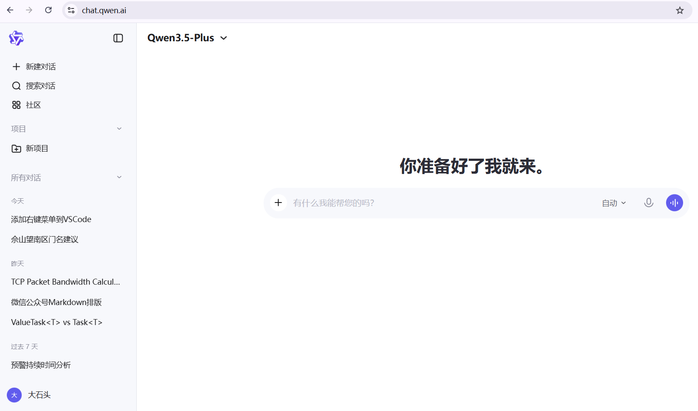
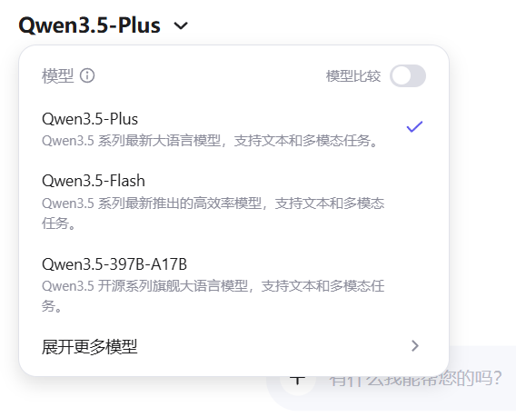
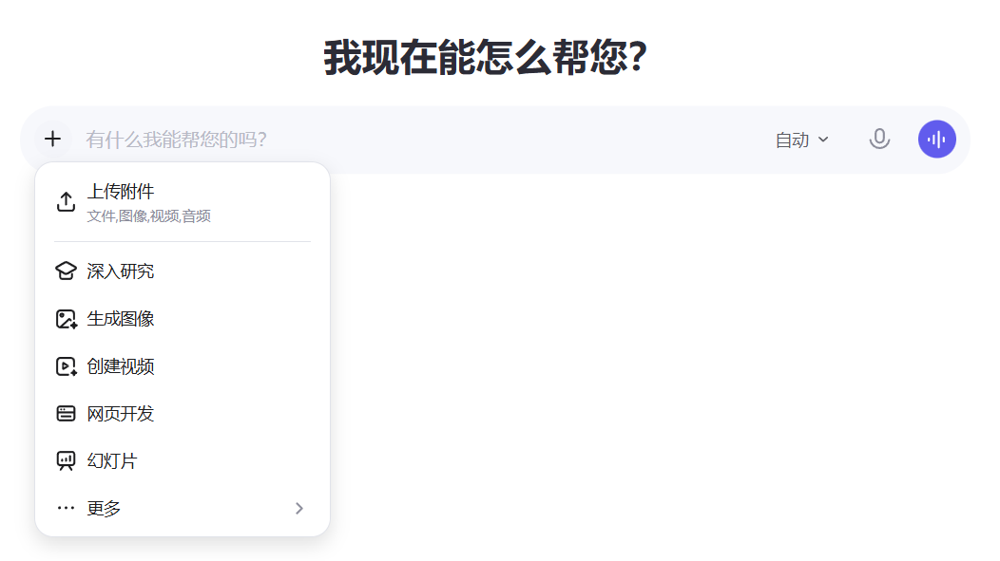

# 对话交互式 AI 系统 — 需求规格说明

> 版本：v0.4  
> 日期：2026-02-28  
> UI 参考：<https://chat.qwen.ai>

---

## 1. 概述

### 1.1 目标

构建一个面向终端用户的多模型对话交互式 AI 系统，提供自然语言问答、多轮对话、附件上传、模型切换、消息流式输出等核心能力。系统以 Web 前端为主要交互界面，后端对接多种大语言模型（LLM）。

### 1.2 用户角色

| 角色 | 说明 |
|------|------|
| 普通用户 | 登录后使用对话功能（登录由外部模块提供） |
| 访客 | 通过分享链接查看共享对话（只读） |
| 管理员 | 管理用户、模型配置、系统设置（后续迭代） |

> **说明**：本系统不负责登录鉴权，由 NewLife.Cube 等外部模块统一处理。后端接口通过当前会话获取 `UserId`。

### 1.3 术语

| 术语 | 含义 |
|------|------|
| 会话（Conversation） | 一次完整的多轮对话上下文 |
| 消息（Message） | 会话中的单条发言，分用户消息和 AI 回复 |
| 模型（Model） | 后端接入的大语言模型，如 GPT-4o、Qwen-Max 等 |
| 流式输出（Streaming） | 服务端逐 token 推送响应内容（SSE） |
| 思考模式（Thinking Mode） | 控制模型推理深度：自动 / 思考 / 快速 |

---

## 2. 整体布局

### 2.1 主界面结构

> 参考截图：
> 

主界面采用 **左右分栏** 布局：

```
┌──────────┬──────────────────────────────────┐
│  侧边栏   │            主内容区               │
│ (可收起)  │                                  │
│          │                                   │
│ 新建对话  │   ┌─ 模型选择器 ─┐                │
│          │   │              │                │
│ 对话列表  │   │   对话内容区   │                │
│ (滚动)   │   │              │                │
│          │   │              │                │
│          │   └──────────────┘                │
│          │                                   │
│ ──────── │   ┌──────────────────────┐        │
│ 个人图标  │   │    输入区 + 操作栏     │        │
│          │   └──────────────────────┘        │
└──────────┴──────────────────────────────────┘
```

- 侧边栏可通过按钮 **收起 / 展开**，收起后仅显示图标，主内容区自动扩展占满宽度。
- 响应式适配：窄屏（移动端）下侧边栏默认收起，通过汉堡菜单唤出。移动端响应式断点为 **768px**：窄于此宽度时侧边栏默认隐藏。
  - **移动端消息操作**：长按消息弹出操作菜单（替代 PC 端的悬停显示）。
- **URL 路由**：每个会话有独立 URL（如 `/chat/{conversationId}`），支持通过 URL 直接打开指定会话。浏览器刷新后保持当前会话不丢失。新会话页 URL 为 `/chat`。

---

## 3. 侧边栏（左侧面板）

### 3.1 新建对话

- 位于侧边栏 **顶部**。
- 点击后在主内容区创建一个新的空白会话，清空对话内容区，聚焦到输入框。
- 当前会话若有内容，自动保存到对话列表。
- **空会话自动清理**：用户新建会话后未发送任何消息就切走或关闭页面，该空会话不保存到对话列表中，自动清理。

### 3.2 对话列表

- 位于新建对话按钮下方，占据侧边栏主体区域。
- **排序**：按最后活跃时间 **从近到远** 排列。
- **分组标签**：今天、昨天、过去 7 天、过去 30 天、更早。
- **默认显示**：初始加载最近 20 条会话摘要（显示标题 + 最后消息时间）。
- **滚动加载**：用户向下滚动时自动加载更多（每次追加 20 条），直到无更多数据。
- **当前会话高亮**：当前打开的会话项带有高亮 / 选中态样式。
- **会话操作**：鼠标悬停时显示操作菜单（三点图标），支持：
  - 重命名会话
  - 删除会话（二次确认）
- **仅支持删除整个会话**，不支持删除单条消息。
- **不支持**会话置顶（本期不含）。
- **不支持**会话搜索（后续迭代考虑）。
- **会话切换**：用户在 AI 回复生成过程中切换到其他会话时，后台流式生成**不中断**，切回时可看到已生成的内容并继续对话。
- **消息加载**：打开历史会话时，**一次性加载全部消息**。
- **不支持**键盘快捷键（除发送快捷键外，本期不含其他快捷键）。

### 3.3 会话标题自动生成

- 新建会话时标题默认为"新建对话"。
- **首条消息发送后**，系统自动根据用户消息内容生成简短标题（10 字以内）。
- 生成策略：调用当前会话使用的模型，以用户首条消息为输入，提示模型输出简短摘要作为标题。
- 自动生成的标题用户可随时手动修改（重命名）。
- 标题生成为异步操作，不阻塞消息响应流程。

### 3.4 个人图标

> 参考截图：
> 

- 位于侧边栏 **底部**，显示用户头像或首字母圆形图标。
- **点击展开菜单**，菜单项自上而下依次为：
  1. **账号名**：显示当前登录用户名称（不可点击，仅展示）。
  2. **设置**：点击后弹出设置页（模态弹窗或全屏覆盖）。

---

## 4. 设置页

> 参考截图：
> 

### 4.1 入口与交互

- 通过个人图标菜单中的"设置"打开。
- 以 **弹窗（Dialog / Modal）** 形式覆盖在主界面之上。
- 左上角有 **返回箭头**（←），点击关闭设置页返回主界面。

### 4.2 设置分组

#### 4.2.1 通用设置

| 设置项 | 类型 | 说明 |
|--------|------|------|
| 语言 | 下拉选择 | 中文（简体）/ 中文（繁体）/ English |
| 主题 | 切换 | 浅色 / 深色 / 跟随系统 |
| 字体大小 | 滑块 | 14px–20px，默认 16px |
| 发送快捷键 | 单选 | Enter 发送 / Ctrl+Enter 发送 |

#### 4.2.2 对话设置

| 设置项 | 类型 | 说明 |
|--------|------|------|
| 默认模型 | 下拉选择 | 从可用模型列表中选择新会话的默认模型 |
| 默认思考模式 | 下拉选择 | 自动 / 思考 / 快速 |
| 上下文轮数 | 数字输入 | 每次请求携带的历史对话轮数，默认 10 |
| 系统提示词 | 多行文本 | 全局 System Prompt，可为空。作用于所有会话，每次请求时作为 `system` 角色消息发送给模型，不在对话内容区中显示。不支持会话级覆盖 |

> **上下文溢出策略**：当历史对话内容（按上下文轮数截取后）仍超出模型的最大 Token 限制时，**从最早的轮次开始丢弃**，直到总 Token 数满足模型限制。系统提示词始终保留，不被丢弃。

#### 4.2.3 数据与隐私

| 设置项 | 类型 | 说明 |
|--------|------|------|
| 导出所有对话 | 按钮 | 导出为 JSON 压缩包（`.zip`），包含所有会话及其消息。JSON 结构：顶层为会话数组，每个会话包含 `id`、`title`、`model`、`createTime`、`messages[]`；每条消息包含 `role`、`content`、`thinkingContent`、`attachments[]`、`createTime`。附件仅导出元信息（文件名、大小、ID），不包含文件本身 |
| 清除所有对话 | 按钮 | 二次确认后删除全部会话数据 |
| 允许用于模型改进 | 开关 | 是否允许点赞 / 点踩数据用于训练优化，默认关闭 |

#### 4.2.4 关于

| 设置项 | 类型 | 说明 |
|--------|------|------|
| 版本号 | 文本 | 当前系统版本 |
| 服务条款 | 链接 | 跳转服务条款页面 |
| 隐私政策 | 链接 | 跳转隐私政策页面 |

---

## 5. 主内容区（右侧）

### 5.1 模型选择器

> 参考截图：
> 

- 位于主内容区 **左上角**。
- 以下拉菜单形式展示，显示当前选中模型名称。
- 点击展开模型列表：
  - 每个模型项显示 **模型名称**（如 Qwen-Max、GPT-4o、DeepSeek-R1 等）。
  - 选中后立即切换，后续对话使用新模型。
  - 已发送的消息不受模型切换影响。
  - **思考模式联动**：切换到不支持思考模式的模型时，若当前思考模式为"思考"，自动回退为"自动"。切换到不支持图片的模型时，已上传的图片附件在后续请求中被忽略（仅发送文本）。
- **仅支持选择模型**，不支持对比、更多等附加功能。

### 5.2 新会话页（空状态）

当无对话内容时，主内容区显示新会话欢迎页：

- 中央显示欢迎语 / 品牌标识。
- 展示 **推荐问题卡片**（如"帮我写一封邮件"、"解释量子计算"等），点击即作为用户消息发送。
- 推荐问题内容由**后台配置**（`ChatSetting` 中维护），支持管理员自定义。
- 底部为输入区。

### 5.3 输入区

> 参考截图：
> 

输入区固定在主内容区底部，包含以下元素（从左到右）：

```
┌─────────────────────────────────────────────────────┐
│ [+]  │      输入框（多行，自动伸缩）       │ [模式▼] [发送] │
└─────────────────────────────────────────────────────┘
```

#### 5.3.1 附件上传（+ 号按钮）

- 点击弹出文件选择器，支持上传附件。
- 支持的文件类型：图片（jpg/png/gif/webp）、文档（pdf/docx/txt/md/csv）。
- 单文件大小限制：20 MB。
- 单次最多上传 5 个文件。
- 上传后在输入框上方以缩略图 / 文件名标签展示，支持移除。
- 支持 **拖拽文件** 到输入区域直接上传。拖拽时主内容区显示半透明遮罩层和"释放以上传文件"提示，释放后自动上传。
- 附件存储复用魔方（NewLife.Cube）已有的附件管理体系。
- **AI 消费附件策略**：
  - **图片**：发送给支持视觉理解的模型（`SupportVision = true`）时，以图片内容传递给模型；若当前模型不支持图片输入，前端提示用户切换到支持图片的模型，或忽略图片仅发送文本。
  - **文档**（PDF / DOCX / TXT / MD / CSV）：后端进行文本提取，将提取的纯文本内容拼入对话上下文一并发送给模型。
  - 附件内容（图片 Token / 文档文本）计入上下文 Token 消耗。

#### 5.3.2 输入框

- 支持多行文本输入，高度随内容自动伸缩（最小 1 行，最大 8 行后出现滚动条）。
- 支持粘贴图片（自动作为附件处理）。
- 支持 Markdown 语法输入。
- 空内容时发送按钮置灰禁用。
- **单条消息最大输入长度**：约 6000 字（参考 Qwen），超出时前端提示并禁止发送。
- **AI 回复生成期间**，输入框和附件上传均禁用，用户不能发送新消息，直到回复完成或点击停止按钮。

#### 5.3.3 思考模式选择器

> 参考截图：
> 

- 位于输入框右侧，以下拉按钮形式展示。
- 选项：
  - **自动**（默认）：由系统根据问题复杂度自动决定推理深度。
  - **思考**：启用深度推理（Chain-of-Thought），适合复杂推理 / 数学 / 编程题。响应速度较慢，但推理准确性更高。
  - **快速**：跳过深度推理，快速返回结果，适合简单问答。响应速度最快。
- 选择后当前会话内保持，切换会话时恢复为用户默认设置。
- 仅当所选模型支持思考模式（`SupportThinking = true`）时，"思考"选项可用；否则仅显示"自动"和"快速"。

#### 5.3.4 发送按钮

- 输入框有内容时激活，点击或按快捷键发送消息。
- 发送后清空输入框，回答生成期间按钮变为 **停止** 按钮（■），可中断生成。

---

## 6. 对话内容区

### 6.1 消息布局

- 用户消息：右对齐，带用户头像，背景色区分。
- AI 回复：左对齐，带模型图标，背景色区分。
- 每条消息显示发送时间（悬停时显示精确时间）。
  - **默认显示相对时间**（如"刚刚"、"5 分钟前"、"昨天"），鼠标悬停时 Tooltip 显示精确时间（如"2026-02-28 14:30:25"）。
- **附件展示**：
  - **图片附件**：在消息中以内联缩略图展示，点击可弹出大图预览（支持缩放）。
  - **文档附件**：以文件类型图标 + 文件名 + 文件大小形式显示，点击可下载。

### 6.2 流式输出

- 用户提问后，AI 回复区域立即出现，内容 **逐段实时输出**（打字机效果）。
- 输出过程中消息区域自动滚动到底部，用户手动上滚时暂停自动滚动。
  - **恢复自动滚动**：用户滚动回底部时，自动滚动恢复。
  - **回到底部按钮**：当用户向上滚动超过一屏时，对话区右下角浮现"↓"按钮，点击可一键回到最新消息并恢复自动滚动。
- 输出完成前显示加载指示器（闪烁光标或脉冲点）。

### 6.3 思考过程展示

当使用 **思考模式** 时，AI 回复分为两部分：

1. **思考过程**：模型的推理链路（Chain-of-Thought），参考 Qwen 的实现：
   - 以可折叠区域展示，默认展开。
   - 区域顶部显示"思考中..."标题，完成后显示"思考过程"及耗时。
   - 内容以较浅颜色/斜体渲染，与正式回答视觉区分。
   - 用户可点击折叠/展开按钮收起思考过程。
   - 流式输出期间，思考过程先输出，完成后再输出正式回答。
2. **正式回答**：模型的最终回复内容，正常渲染。

快速模式下不显示思考过程区域。自动模式下由模型决定是否返回思考过程。

### 6.4 Markdown 渲染

消息内容以 Markdown 格式渲染，特别支持：

| 元素 | 说明 |
|------|------|
| 标题 | h1–h6 |
| 列表 | 有序 / 无序 / 嵌套列表 |
| 表格 | 标准 Markdown 表格，支持对齐 |
| 代码片段 | 行内代码 + 代码块（语法高亮 + 每个代码块右上角显示一键复制按钮）|
| 流程图 | 支持 Mermaid 语法渲染为交互式流程图 |
| 数学公式 | 支持 KaTeX / LaTeX 渲染 |
| 链接 / 图片 | 可点击跳转 / 内联预览 |
| 引用块 | 块引用样式 |

### 6.5 消息操作

> 参考截图：
> 

#### 6.5.1 通用操作（用户消息 & AI 回复均支持）

- **复制**：复制消息原始文本（Markdown 源码）到剪贴板。复制成功后图标短暂变为 ✓（约 2 秒后恢复），提供明确的视觉反馈。
- **编辑**：点击后消息变为可编辑状态；
  - 用户消息编辑后保存并重新发送：**删除该消息之后的所有消息**（包括对应的 AI 回复及后续全部对话），以编辑后的内容重新发送，触发新的 AI 回复。此行为与 Qwen、ChatGPT 等主流 AI 对话产品一致。
  - AI 回复编辑后仅修改显示内容，不触发新请求。编辑后的内容**会**作为后续对话的上下文（即后续请求携带的是编辑后的版本）。
  - 编辑时显示"保存"和"取消"按钮。

操作入口：鼠标悬停消息时，在消息右上角 / 底部浮现操作图标（移动端为长按弹出菜单）。

#### 6.5.2 AI 回复专属操作

AI 回复下方显示一排操作按钮，从左到右依次为：

| 按钮 | 图标 | 说明 |
|------|------|------|
| 复制 | 📋 | 复制回复全文到剪贴板，成功后图标短暂变为 ✓ |
| 点赞 | 👍 | 对回复表示满意；点击后高亮，再次点击取消 |
| 点踩 | 👎 | 对回复表示不满意；可弹出反馈输入框收集原因 |
| 分享 | 🔗 | 创建共享链接（详见 6.8 节） |
| 重新生成 | 🔄 | 仅**最后一条** AI 回复显示此按钮，使用当前模型重新生成，新回复直接替换当前回复 |

#### 6.5.3 停止生成

- 回答生成期间，发送按钮变为 **停止** 按钮（■）。
- 点击停止后，已输出的部分内容保留显示，不再继续生成。
- 停止后用户可继续发送新消息；**被截断的 AI 回复不计入后续对话的上下文**，避免不完整内容影响后续推理。

### 6.6 错误展示

- **模型回复错误**（如模型不可用、上下文过长、生成超时等）：在对话内容区内联显示错误提示气泡（红色文字），与消息流一致，不弹窗。
- **SSE 网络异常**（流式输出期间网络中断，非用户主动停止）：
  - 保留已输出的部分内容。
  - 在消息底部显示"网络异常，请重试"提示。
  - **自动重试**：最多自动重试 3 次，每次间隔递增（1s / 2s / 4s）。3 次均失败后停止，保留已有内容，显示"重试失败"提示。
- **其他操作错误**（设置保存、附件上传、分享创建等非对话相关操作）：由前端自行决定展示方式（Toast / 弹窗等）。

### 6.7 点赞 / 点踩

- 点赞与点踩数据上报服务端，**可用于模型学习训练**。
- 用户可在设置页的"数据与隐私"中关闭此功能（关闭后点赞 / 点踩仍可操作，但数据不上报）。
- 点踩时可选填反馈原因（多选标签 + 自由文本）：
  - 回答不准确
  - 回答不完整
  - 格式混乱
  - 内容有害
  - 其他（自由输入）

### 6.8 分享功能

> 参考截图：
> 

- 点击"分享"按钮后：
  1. 系统生成一个唯一的 **共享链接**（URL）。
  2. 弹窗展示链接，用户可一键复制。
  3. **共享范围**：仅包含创建链接时刻之前的对话内容，之后新发送的消息不被共享。
  4. **同一会话可多次分享**，每次分享生成新链接，旧链接仍有效。
  5. 拥有 URL 的任何用户均可查看共享对话（**只读**，无需登录）。
  6. **有效期**：由后台系统配置统一设定（`ChatSetting.ShareExpireDays`），默认 30 天，设为 0 表示永不过期。
- 共享对话页面：
  - 共享页面 URL 格式为 `/share/{token}`。
  - 顶部显示"共享对话"标识 + 分享者信息。
  - 完整展示共享范围内的对话内容（Markdown 渲染）。
  - 不显示操作按钮（点赞 / 编辑等）。
  - 底部显示"使用 XXX 开始你的对话"引导。

### 6.9 Token 用量展示

- AI 回复完成后，在消息底部（操作按钮区域旁）显示本次对话的 Token 用量统计。
- 显示格式示例：`150 + 320 = 470 tokens`（提示 + 回复 = 总计）。
- 信息来源为 SSE `message_done` 事件中的 `usage` 字段。

---

## 7. 非功能性需求

### 7.1 性能

- 首条 token 响应延迟（TTFT）：≤ 2 秒（不含模型推理）。
- 流式输出帧率：≥ 10 token/秒 的渲染刷新。
- 会话列表首屏加载：≤ 500 ms。

### 7.2 可用性

- 系统可用性目标：99.9%。
- 模型服务不可用时直接返回错误提示，不做自动降级。
- **加载状态**：
  - 页面初始加载时显示全屏骨架屏（Skeleton）。
  - 会话切换时对话区显示加载指示器。
  - 附件上传时显示上传进度条。

### 7.3 安全

- 全站 HTTPS。
- 登录鉴权由外部模块（NewLife.Cube）提供，本系统接口预留扩展点。
- XSS 防护：Markdown 渲染时过滤危险标签和脚本。
- 速率限制：按用户维度限流，防滥用。默认每分钟 20 次消息发送，限流时返回 `RATE_LIMITED` 错误，前端提示"请求过于频繁，请稍后再试"。
- 共享链接：Token 使用不可猜测的随机值（UUID / NanoID）。

### 7.4 兼容性

- 浏览器：Chrome / Edge / Firefox / Safari 最新两个大版本。
- 移动端：iOS Safari / Android Chrome 响应式适配。

---

## 8. 本期范围说明

### 8.1 本期包含

- 第 2～6 章定义的全部 UI 交互功能。
- 后端 API 接口（详见架构设计文档）。
- 流式消息输出（SSE）。
- 重新生成、停止生成。
- 附件上传（复用魔方附件体系）。
- 分享功能。
- 会话标题自动生成。
- 思考过程折叠展示。

### 8.2 本期不包含（明确排除）

| 排除项 | 说明 |
|--------|------|
| 登录鉴权 | 由 NewLife.Cube 等外部模块提供 |
| 管理后台 | 后续迭代 |
| 消息分支 | 编辑/重新生成不保留历史版本，直接替换 |
| 会话搜索 | 后续迭代考虑 |
| 模型降级 | 模型不可用时直接报错 |
| 会话置顶 | 本期不支持 |
| 单条消息删除 | 仅支持删除整个会话 |
| 语音输入 / 网页搜索 | 后续完善 |
| 对比模式 | 不支持多模型并行对比 |
| 键盘快捷键 | 除发送快捷键外不支持其他快捷键 |

---
